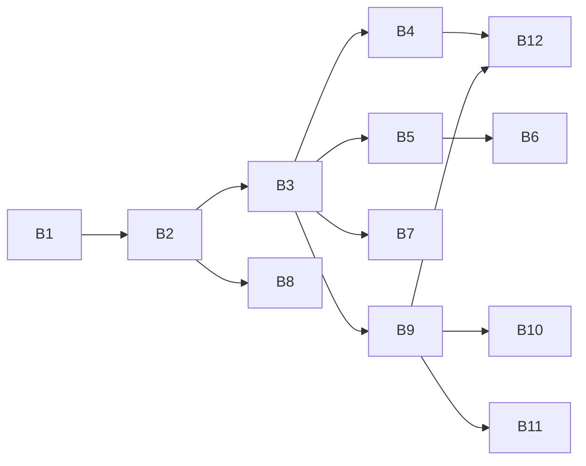

# Upstream PRs for Tab Stacks

This is the plan for sending fork PR [AlexJSully/vscode#1](https://github.com/AlexJSully/vscode/pull/1) to `microsoft/vscode` as narrow pull requests:

- **Track A:** 3 PRs, each fixing one bug on `main` that the Tab Stacks feature needs and that reproduces by hand in VS Code 1.141.0. Each goes before the B PR that needs it.
- **Track B:** the Tab Stacks feature as 12 pull requests: three in a row bring up a first tab stack a reviewer can try, then one PR per feature. It starts once the check-in on microsoft/vscode#100335 gets a go-ahead.
- **Track C:** 3 fixes for bugs on `main` that Tab Stacks does not need. They wait until the bugs matter more. Not yet reproduced by hand.
- **Track D:** the deferred bugs in `FOLLOW-UP-BUGS.md`. Not yet reproduced by hand.
- **Track E:** features left out of scope.

This file is fork-only, like `FOLLOW-UP-BUGS.md`. Neither file goes into an upstream pull request.

## How to use this doc

- **Remotes:** `origin` is AlexJSully/vscode and `upstream` is microsoft/vscode.
- **Branching:** a Track A, C or D PR starts from the latest `upstream/main`. A Track B PR starts from the branch of the B PR it depends on (see "The fastest path").
- **Branch names:** `{type}-alexjsully-{YYMMDD}-{up to three words}`, where the type is `fix`, `feature`, `chore`, `test` or similar, and the date is the day the branch is created. The Status table holds a draft name for every PR, dated 261007 until its branch exists.
- **What a PR is built from:** each PR is cut from the final state of the fork branch `alexjsully-260925-group-tabs`. Fork commits are never replayed, because the fork history iterated. Port only the lines the PR needs, and rebuild the "entangled" fixes against the code of `main`.
- **Size:** count every changed line, tests and docs included (`git diff --shortstat` against the PR's base). A Track B PR aims for about 1,000 lines, and up to about 1,250 is fine; 500 to 700 is the sweet spot when the scope allows it. Every PR must make sense on its own: never split a unit that only makes sense whole, and combine a PR too small to stand alone with one of the same scope. Split only a PR well over the limit, along a line where each half still stands alone.
- **Who does what:**
  - Claude makes the working-tree edits and tests on the branch you created, runs the checks, and drafts the PR text.
  - You review, commit, push and open the PR. Claude never runs git or gh writes.
- **Stacking from a fork:**
  - Upstream PRs can only target `microsoft/vscode:main`.
  - So each stacked PR also carries the commits of the PRs below it until those merge.
  - Its description says "Depends on #N. Please review only the last commit(s)."
  - After a merge, rebase the next branch onto `upstream/main`.
- **A bug is real only when it reproduces by hand in released VS Code.** A failing unit test, code reading or a scripted run is not enough. Before any Track A, C or D PR, follow its steps by hand in released VS Code; if it does not reproduce, scrap it.
- **Evidence:** every Track A and C row has an entry under "Fixed as part of Tab Stacks" in `FOLLOW-UP-BUGS.md`. That entry has the evidence on `main` at `e5f3c4cdf79`, the tests, and the "Upstream PR" port note.
- **PR materials:** descriptions, issue text and screenshots live in `/Users/joohyun/Documents/code/vscode-tab-stacks-pr-screenshots/`, one folder per PR.

### Per-PR checklist

- [ ] Narrow scope: every changed line is needed for the PR's goal, with no unrelated edits.
- [ ] Every model or API member the PR adds has a caller in the same PR, or in its tests for a model-only PR.
- [ ] A test that fails without the change, in the right suite, with one snapshot `assert.deepStrictEqual` where it fits.
- [ ] Targeted suites pass: `env -u ELECTRON_RUN_AS_NODE ./scripts/test.sh --grep "<suites>"`.
- [ ] `npm run typecheck-client`, eslint on the changed files, and `node build/stylelint.ts` when CSS changed.
- [ ] Hygiene: `{ git diff --name-only; git ls-files --others --exclude-standard; } | xargs node --experimental-strip-types build/hygiene.ts`.
- [ ] `npm run valid-layers-check` and `npm run define-class-fields-check`.
- [ ] Follows `.github/instructions`: comment limits, no new `!important`, design tokens.
- [ ] A PR description from `.github/pull_request_template.md`, with "Fixes #…" or "Refs #100335" and a test plan.
- [ ] Copilot review comments resolved before asking for human review.

## Track A: bug fixes that Tab Stacks needs

These fix bugs that exist on `main`. Each one is needed by a B PR, so it goes upstream before that PR. The table is in priority order: by the first B PR that needs each fix, with each fix after the fixes it builds on. "Needed" means one of three things, named in the last column: the B PR calls code the fix adds (**code**), a Tab Stacks test fails without it (**test**), or the tracker's blocking review lists it because a Tab Stacks feature breaks without it (**blocks**).

"Entangled" means the fork's fix lives inside Tab Stacks code, so the A PR rebuilds it for `main`. Each entry's port note in `FOLLOW-UP-BUGS.md` says what changes.

| # | PR | Main files | Depends on | Port | Needed by |
| --- | --- | --- | --- | --- | --- |
| A3 | With wrapped tabs, closing a tab with its close button or a middle click keeps the next reveal of the active tab from happening once wrapping is off | `multiEditorTabsControl.ts` (`doLayoutTabs` wrapping branch, one line) | none | independent; needs its own failing test that clicks no tab stack header, and adds the test helper `createNamedEditor` | B4 (test: clicking a header while tabs wrap) |
| A5 | A drop of an editor the group already has lands one slot past where the drop shows, in the Open Editors view (FB-15) and the tab bar, for one file or several | `workbench/browser/dnd.ts` (`findEditorOfDroppedEditor`), `contrib/files/browser/views/openEditorsView.ts`, `multiEditorTabsControl.ts` (`onDrop`) | none | independent for the Open Editors view; entangled for the tab bar | B9 and B11 (code and test: an editor can land inside a tab stack and join it; the tab stack drop tables) |
| A4 | FB-13: after a drop on a tab from outside the tabs, the next drag that crosses the tabs and drops elsewhere leaves its drop marker on the tabs | `base/browser/dom.ts` (`DragAndDropObserver.reset`), `multiEditorTabsControl.ts` (a capture-phase drop listener on the tabs container) | none | independent; adds the test helpers `dispatchDrag`, `tabsChild`, `describeTabsChild`, `classicGroup`, `dragEditors` and `dropFeedback` | B10 (blocks: the stale marker, and the drop space after a tab stack, stay behind) |

A PR keeps its number from the earlier plan, so branches and notes still match. A1, A2 and A7 moved to Track C as C1, C2 and C3. A3 and A5 were prepared and then deferred; their descriptions and screenshots exist, but their scope is now narrower, so trim them, and port the code again.

### Reproduced in VS Code 1.141.0 (2026-10-08)

Each was driven with real mouse and keyboard input in the installed VS Code 1.141.0, with a fresh profile and no extensions, against a control run. Screenshots are in `repro-1.141/` in the PR materials folder. **Confirm each by hand before its PR.**

- **A3.** Set `"workbench.editor.wrapTabs": true` and open 12 files, so the tabs wrap onto two rows. Click the first tab. Close the third tab with its close button, or by middle-clicking it. Open the twelfth file with Quick Open (⌘P). Set `"workbench.editor.wrapTabs": false`. **Bug:** the tabs stay scrolled to the start and the active tab is out of view. **Control:** without closing the third tab, the active tab scrolls into view. Reproduced by hand with both the close button and a middle click.
- **A5.** Open file01 to file04, in that order. Drag file01 from the Explorer onto the top half of file03 in Open Editors: the line shows above file03. **Bug:** the order is `file02 file03 file01 file04`, not `file02 file01 file03 file04`. The same drag onto the left half of file03's tab, with the marker between file02 and file03, gives the same wrong order. Dragging file01 and file02 together before file04 gives `file03 file04 file01 file02`.
- **A4.** Reload the window, since an earlier drop in the session may already have caused the bug. Open file01 to file04. Drag file06 from the Explorer onto the right half of file03's tab and drop it. Drag file07 from the Explorer across file02's tab, then down into the editor, and drop it there. **Bug:** a white drop marker stays on the tab bar between file01 and file02 until the next drag over the tabs. **Control:** without the first drop, nothing is left behind.

### Scrapped or out of Track A after the re-check

- **A10** (editors opened after a Split in Group editor): could not be reproduced by hand. Removed.
- **FB-12** (Modern UI tabs keep wrapping on one row): the `wrapping` class does stay set, but nothing on screen differs from classic tabs. Not a visible bug on `main`. If a Tab Stacks PR (B7 or B10) shows a visible symptom, it fixes it there with a test of that symptom.
- **FB-19 and the tab bar version** (files dropped together land apart): do not reproduce. In 1.141.0 the files stay together and both land one slot past, which is A5. "Apart" only shows once one-slot-past is fixed for the first file alone, so A5's fix must keep them together; that's part of its design, not a separate bug.
- **FB-20** (marker stays over the Add Tab control): by its own entry, it can only show after the FB-14 fix, so it does not exist on `main`.
- **FB-14** (no marker on the empty tab space in the Agents window): not checked. The Agents window needs a sign-in. It stays out of A4 unless you reproduce it by hand; if you do, it joins A4.

## Track B: the Tab Stacks feature stack

The stack is ordered to show a working tab stack as early as possible, then add one feature per PR. Three PRs in a row (B1, B2 and B3) bring up the first tab stack that a reviewer can create and see. Every later PR adds one feature a reviewer can try.

### How the PRs are cut

- **Each PR makes sense on its own.** A piece that only makes sense together with another stays in the same PR, as long as the PR stays under about 1,250 lines with tests.
- **Same-scope pairs are combined when they fit.** The model and the rules that keep tab stacks whole are one PR (B1). The tab slot refactor is the first commit of the PR that draws tab stacks (B3). The header menu ships with the name and color bubble it opens (B5). Dragging a header ships with the other drags within a group (B9).
- **Pairs stay apart only when they are too big together and each half stands alone:** the group API and the tab bar (B2 and B3, about 2,000 lines together), and drops within a group and drops at the end of a tab stack or from other groups (B9 and B10, about 1,650 together).
- **Each model or API member lands in the PR that first uses it:** `updateTabStack` in B4, `FilteredEditorGroupModel.getTabStack` in B3, the `MainThreadEditorTabs` no-op in B2, the undo snapshot in B5, the hiding records in B8, and `moveEditorsWithinGroup` and `moveTabStack` in B9.

### The fastest path

1. **Day one, B0:** post the check-in on microsoft/vscode#100335 with the video and a link to AlexJSully/vscode#1. The team sees the whole feature before any PR exists.
2. **Open B1.** No A fix blocks the first phase.
3. **The serial chain:** B1, then B2, then B3. When B3 is open, reviewers can check it out, turn on the setting, right-click a tab, choose Add to New Tab Stack, and see it.
4. **Features:** after B3, several feature PRs can be cut at once, since most only need B3. The graph below shows what each one waits for.



A PR branches from the PR it depends on. Where it depends on two (B12 needs B4 and B9), branch from one and merge the other in, or wait until one of them merges.

### B0: check in on microsoft/vscode#100335

Post this before B1 and wait for a maintainer reply. Claude drafts it with you; you post it.

> I've built Chrome-style tab groups for editor tabs as an experimental setting (`workbench.editor.enableTabStacks`, off by default). The name is "Tab Stack" because the `tabGroups` API already means editor groups. Here's a demo: (link to the video in AlexJSully/vscode#1). It keeps Chromium's tab strip rules (stacks are contiguous, pinned and preview tabs are never members, new tabs never join), and hides stacks without deleting them while the setting is off. I'd like to upstream it as a series of PRs of about 1,000 lines each with tests: three that bring up a first working tab stack, then one per feature (collapse, naming and colors, persistence, drag and drop, keyboard moves). Would the team take this, and is there anything you'd want shaped differently first?

### Phase 1: the first visible tab stack

Sizes are lines with tests, estimated from the fork and from the prepared B1 work; the cut decides the real number.

| # | PR | Scope | Lines | Depends on | Tests (suites) |
| --- | --- | --- | --- | --- | --- |
| B1 | Tab stack model | New `common/editor/editorGroupTabStacks.ts`: types, the 9 preset colors and custom `#rrggbb`, and the array-only helpers. `EditorGroupModel`: add and remove; pinned and preview editors are never members, and members cannot be unpinned; sticking or closing an editor takes it out, and the last one out deletes the tab stack; new editors open next to a tab stack, never inside it, unless the `tabStack` open option names it; a moved editor keeps, joins or leaves a tab stack by where it lands, as replayable single moves; one `TAB_STACKS` event per operation (`common/editor.ts`); turning tab stacks off removes them; clone copies them. No UI. | about 1,200 | none | `EditorGroupModel`, `EditorGroupTabStacks` |
| B2 | Setting, editor group API and the first commands | The setting `workbench.editor.enableTabStacks` (experimental, off) in `browser/workbench.contribution.ts` and `common/editor.ts`, with `isTabStacksEnabled`. The first tab stack members of `IEditorGroup` (`services/editor/common/editorGroupsService.ts`): `tabStacks`, `getTabStack`, `addEditorsToTabStack` and `removeEditorsFromTabStack`; later PRs add the rest with their first callers. `EditorGroupView`: turns tab stacks on and off with the setting, runs the operations and replays their moves to the title control, and opens editors past a tab stack in `openEditors`. The `TAB_STACKS` no-op in `mainThreadEditorTabs.ts`, since the events start firing here. Context keys (`common/contextkeys.ts`). Test services. Add to New Tab Stack and Remove from Tab Stack in the tab context menu and the Command Palette (`editorCommands.ts`, `editorCommandsContext.ts`, `editor.contribution.ts`). Tabs move together, but nothing draws tab stacks yet. | about 750 | B1 | `EditorGroupsService`, `MainThreadEditorTabs`, `Workbench editor utils`, `Resolving Editor Commands Context` |
| B3 | Show tab stacks in the tab bar | First commit, behavior-neutral: tabs in `multiEditorTabsControl.ts` live in an explicit slot array, so a slot can hold something other than a tab. Then new `tabStacksControl.ts`: a header before each tab stack, the colored underline of members, and accessible names ("tab stack {name}, {n} editors" for a header, and ", in tab stack {name}" added to the name each member already has). `FilteredEditorGroupModel.getTabStack`, which the rows of pinned and unpinned tabs ask. `updateTabStacks` in the tab-control interfaces (`editorTabsControl.ts`, `editorTitleControl.ts`, `multiRowEditorTabsControl.ts`, `noEditorTabsControl.ts`, `singleEditorTabsControl.ts`). Classic tab CSS in `multieditortabscontrol.css`. The 9 theme colors in `common/theme.ts` and `build/lib/stylelint/vscode-known-variables.json`. Component fixtures for classic tabs. **The first PR a reviewer can try.** | about 1,250 | B2 | `MultiEditorTabsControl`, `FilteredEditorGroupModel`, component fixtures |

### Phase 2: one feature per PR

| # | PR | Scope | Lines | Depends on | Tests (suites) |
| --- | --- | --- | --- | --- | --- |
| B4 | Collapse and expand | `updateTabStack` in the model and the group. The collapsed state in the model: a collapsed tab stack never holds the active editor, closing the active editor skips hidden ones, activating a hidden editor expands its tab stack, and hidden editors leave the selection. Clicking a header, or Enter or Space on it, and the Collapse Tab Stack and Expand Tab Stack commands. Collapsing the active editor's tab stack opens the next visible editor. `workbench.editor.limit` never closes hidden editors (`editorsObserver.ts`). Screen reader announcements of collapse and expand (`setTabStackCollapsed`). | about 850 | B3, A3 | `EditorGroupModel`, `MultiEditorTabsControl`, `EditorGroupsService`, `EditorsObserver` |
| B5 | Rename, recolor and remove a tab stack from its header | The header context menu (Shift+F10 and right click) with Rename..., Change Color..., Remove Tab Stack, which keeps the tabs open, and Close Tab Stack. The header hover. New `tabStackEditor.ts` and `media/tabstackeditor.css`: the name and color bubble, which opens under the header of a new tab stack and from Rename... and Change Color.... `editTabStack` through the tab controls. Enter or clicking elsewhere keeps changes; Escape cancels a new tab stack (the model's undo snapshot) or reverts a rename or color change. | about 1,200 | B3 | `TabStackEditor`, `EditorGroupsService`, `MultiEditorTabsControl` |
| B6 | Add to Tab Stack and quick input fallbacks | Add to Tab Stack... with a picker of tab stacks. Rename and Change Color fall back to a quick input where the header is not shown. New `tabStackPickers.ts`, with custom `#rrggbb` colors kept separable in case review asks to drop them. | about 750 | B5 | `TabStackPickers`, `EditorGroupsService` |
| B7 | Modern UI and Agents window styles | Tab stack CSS for Modern UI connected and pill tabs (`connectedEditorTabs.css`, `contrib/modernUI/browser/media/tabs.css`), including the outline of the active member, wrapped tabs, pinned tabs on a separate row, high contrast, and the Agents window (`sessions/browser/parts/media/editorPart.css`). Their component fixtures. | about 550 | B3 | `ModernUIContribution`, `Sessions - EditorPart`, component fixtures |
| B8 | Tab stacks persist | Turning the setting off, or showing tabs as single or none (for example in Zen Mode), hides tab stacks instead of removing them, and turning them on rebuilds each from its record. Tab stacks are saved with the group and restored with validation. `replaceEditors` keeps membership, also of hidden tab stacks. `mergeGroup`, moving a group to a new window and closing an auxiliary window keep tab stacks (`editorPart.ts`, the record helpers in `editor.ts`). | about 750 | B2 | `EditorGroupModel`, `EditorGroupsService` |
| B9 | Drag and drop within a group | New `tabsDropHandler.ts` for Chrome's drop rules within a group: between members joins, the right half of the last tab joins, the next tab leaves. The inside marker in the tab stack color. Dragging a header moves the whole tab stack. `moveEditorsWithinGroup` and `moveTabStack` in the model and the group. | about 1,000 | B3, A5 | `EditorGroupModel`, `EditorGroupsService` drop tables, `MultiEditorTabsControl` |
| B10 | Drops at the end of a tab stack and from other groups | The drop space after a tab stack that ends the tab bar, where a drop leaves the tab stack. Tabs from another group or window follow the same rules (the `tabStack` open option). | about 650 | B9, A4 | `EditorGroupsService` drop tables, `MultiEditorTabsControl` |
| B11 | File and Open Editors drops keep tab stacks whole | Files from the Explorer never join a tab stack. Open Editors drags keep a whole tab stack together and never split one (`openEditorsView.ts`, the drop helpers in `editor.ts`, `TabsDropHandler.moveDroppedEditorsOfGroup`). Tab-bar `beforeOpen` anchoring in `workbench/browser/dnd.ts`. | about 800 | B9, A5 | `Files - OpenEditorsView`, `EditorGroupsService` |
| B12 | Keyboard moves | Move Editor Left, Right, First and Last follow Chrome when the group has tab stacks: at a stack's edge, the first press joins or leaves without moving; a collapsed stack is hopped over in one press; moves never cross into the pinned tabs (`moveEditorsByTabWithTabStacks` in `editor.ts`). Screen reader announcements of moving into or out of a tab stack. | about 600 | B4, B9 | `EditorGroupModel`, `EditorGroupsService` move table |

### What the first phase leaves out

Between B3 and the features, the experimental setting gives a working but basic tab stack. That is fine for a setting that is off by default, but each PR description should say what is still to come:

- tab stacks cannot be collapsed (B4) or named (B5);
- turning the setting off, or a reload, loses them (B8);
- drags and Move Editor keep them whole by position, without Chrome's exact drop targets or keyboard rules (B9 to B12);
- Modern UI tabs show them without their own styles (B7).

Each B PR that changes the UI carries:

- the matching screenshots (light, dark and high contrast);
- a note that the setting is experimental and off by default;
- why the feature is called "Tab Stack";
- for B3, B4 and B12, a request for an accessibility review.

## Track C: bug fixes that Tab Stacks does not need

These fix bugs that exist on `main` but that no B PR needs. They wait until the bugs matter more, for example a user report. None has been reproduced by hand yet; do that first.

| # | PR | Main files | Port | Prepared |
| --- | --- | --- | --- | --- |
| C1 (was A1) | Pill-mode sticky mask covers the gutter below the pills | `contrib/modernUI/browser/media/tabs.css`, test in `modernUI.contribution.test.ts` | independent | description, issue text and screenshots in `a1-pill-sticky-mask/` |
| C2 (was A2) | A drag over the tabs scrolls only sideways, not up by a pixel | `media/multieditortabscontrol.css` (the `scroll` rule) | independent | description, issue text, screenshots and `a2.patch` in `a2-drag-scroll/` |
| C3 (was A7) | FB-4, FB-16 and FB-18: a tab's accessible name shows the wrong pinned or preview state | `multiEditorTabsControl.ts` (the accessible names of tabs) | independent | drafted on `fix-alexjsully-261007-tab-aria-state`, with description, issue text and before-and-after accessibility trees in `a7-pinned-row-aria/` |

C1 and C2 only show on Modern UI tabs, which are experimental. C1 shows only with an opaque `modernEditorTab.inactiveBackground`, and C2 is a 1px shift after a drag. They stay separate PRs, since one is a static mask and the other a drag, but C2 can share a PR with FB-17 once FB-17's fix is decided: both are about dragging over the tabs.

C3 fixes accessibility. Tab Stacks makes its bugs come up more often, since tab stack members sit on the row of unpinned tabs and adding a preview to a tab stack pins it, but no B PR needs the fix: B3 adds the tab stack to the name each tab already has. The wrong state is only in the accessible name (`aria-label`), and FB-16 and FB-18 last only until the next tab click, so check it with the element picker of the developer tools rather than by clicking tabs. The draft also redraws the separator after the last pinned tab when a move changes the sticky state, a separate visual bug that belongs in its own PR. FB-21 can join C3, since both are about a tab's accessible name.

## Track D: deferred bugs in FOLLOW-UP-BUGS.md

FB-1 to FB-3, FB-5 to FB-11, FB-17, FB-21, FB-22 and FB-23 were found by reading code or tests, and do not block Tab Stacks. None has been reproduced by hand yet; reproduce each before its PR. Each becomes a standalone PR once fixed, in the order in `FOLLOW-UP-BUGS.md`, except where small fixes of the same scope share one: FB-1, FB-2 and FB-3 (the restored group state and the comment on its `sticky` field), and FB-7 and FB-8 (multi-selection on keyboard moves and on close). FB-17 can join C2 (dragging over the tabs), and FB-22 can join A4 (the drop marker) if it reproduces by hand and is fixed before A4 opens. FB-21 can join C3 (a tab's accessible name). FB-23 waits on microsoft/vscode#339489.

## Track E: features left out of scope

- dragging a whole tab stack to another group or window;
- reopening a closed tab stack;
- grouping in the Open Editors view;
- tab stacks in the extension API;
- keyboard navigation of tab stack headers.

## Command templates

Claude never runs these. Start a Track A or C PR branch:

```sh
git fetch upstream
git switch -c <branch> upstream/main
```

Start a Track B PR branch from the one before it:

```sh
git switch -c <branch> <previous-b-branch>
```

Finish a PR:

```sh
git add <files>
git commit
git push -u origin <branch>
gh pr create --repo microsoft/vscode --base main --head AlexJSully:<branch> --body-file <file>
```

Rebase a stacked branch after the PR below it merges:

```sh
git fetch upstream
git switch <branch>
git rebase upstream/main
git push --force-with-lease
```

## Status

Status values: not started, prepared, deferred, in progress, open, changes requested, merged. Branch names are drafts until the branch exists.

| # | Branch | Upstream PR | Status | Notes |
| --- | --- | --- | --- | --- |
| A3 | `fix-alexjsully-261007-wrap-reveal-block` | | deferred | Needed by B4. Reproduced by hand with the close button and a middle click. Description and screenshots in `a3-wrap-reveal-block/`; code to port again. |
| A5 | `fix-alexjsully-261007-editor-drop-position` | | deferred | Needed by B9. Reproduced in 1.141.0, in Open Editors and the tab bar. Description and screenshots in `a5-open-editors-drop-index/` cover FB-15; add the tab bar, drop the "apart" claims, and port the code again. |
| A4 | `fix-alexjsully-261007-stale-drop-marker` | | not started | Needed by B10. FB-13 only; reproduced in 1.141.0. FB-14 joins only if reproduced by hand. |
| B0 | none (a comment) | microsoft/vscode#100335 | not started | Check-in comment, with the video. |
| B1 | `feature-alexjsully-261006-tab-stack-model` | | in progress | Exists as `alexjsully-261006-tab-stack-model`. Prepared as "B1a" (1,531 lines with tests); recut by moving the collapse model and `updateTabStack` to B4, `FilteredEditorGroupModel.getTabStack` to B3, and the `MainThreadEditorTabs` no-op to B2. |
| B2 | `feature-alexjsully-261007-tab-stack-api` | | not started | The `MainThreadEditorTabs` no-op comes from the prepared "B1a". |
| B3 | `feature-alexjsully-261007-tab-stack-headers` | | not started | First visible tab stack. `FilteredEditorGroupModel.getTabStack` comes from the prepared "B1a". |
| B4 | `feature-alexjsully-261007-tab-stack-collapse` | | not started | The collapse model and `updateTabStack` come from the prepared "B1a". |
| B5 | `feature-alexjsully-261007-tab-stack-editing` | | not started | Port the undo snapshot from `b1-tab-stack-model/backup-before-split/`, which has the review fixes. |
| B6 | `feature-alexjsully-261007-tab-stack-pickers` | | not started | |
| B7 | `feature-alexjsully-261007-modern-ui-styles` | | not started | |
| B8 | `feature-alexjsully-261007-tab-stack-persistence` | | not started | The model part is prepared as "B1b" in `b1b-hide-and-persist/`. Port `replaceInHiddenTabStacks` from `b1-tab-stack-model/backup-before-split/`. |
| B9 | `feature-alexjsully-261007-drag-within-group` | | not started | Port `moveEditorsWithinGroup` with its move helper parameters, and `moveTabStack`, from `b1-tab-stack-model/backup-before-split/`. |
| B10 | `feature-alexjsully-261007-cross-group-drops` | | not started | Also the drop space at the end of a tab stack. |
| B11 | `feature-alexjsully-261007-file-drops` | | not started | Explorer files and the Open Editors view. |
| B12 | `feature-alexjsully-261007-keyboard-moves` | | not started | |
| C1 | `fix-alexjsully-261007-pill-sticky-mask` | | deferred | Prepared on `alexjsully-fix-pill-mode-sticky`. |
| C2 | `fix-alexjsully-261007-drag-vertical-scroll` | | deferred | Prepared on `alexjsully-261006-drag-over-tabs`; `a2.patch` holds the code. Can share a PR with FB-17. |
| C3 | `fix-alexjsully-261007-tab-aria-state` | | prepared | Was A7; not needed by B. Drafted on its branch, with before-and-after accessibility trees in `a7-pinned-row-aria/`. Before sending, rewrite its How to test with the developer tools repro, and move the tab border fix to its own PR. Can take FB-21. |
| FB-10 | `test-alexjsully-261007-command-context-assert` | | not started | Track D, in the order of `FOLLOW-UP-BUGS.md`. |
| FB-5 | `fix-alexjsully-261007-move-index-range` | | not started | |
| FB-6 | `fix-alexjsully-261007-transient-event-index` | | not started | |
| FB-11 | `fix-alexjsully-261007-long-press-menus` | | not started | |
| FB-22 | `fix-alexjsully-261007-wrapped-drop-markers` | | not started | Can join A4 if fixed before A4 opens. |
| FB-7, FB-8 | `fix-alexjsully-261007-multiselect-state` | | not started | One PR: multi-selection on keyboard moves and on close. |
| FB-21 | `fix-alexjsully-261007-stale-group-aria` | | not started | Can join C3. |
| FB-1, FB-2, FB-3 | `fix-alexjsully-261007-restored-group-state` | | not started | One PR: the restored group state and the comment on its `sticky` field. |
| FB-9 | `chore-alexjsully-261007-stylelint-known-variables` | | not started | |
| FB-17 | `fix-alexjsully-261007-drag-scrollbar-overlap` | | not started | Can join C2 once its fix is decided. |
| FB-23 | `fix-alexjsully-261007-short-tab-icon` | | deferred | Waits on microsoft/vscode#339489. |
